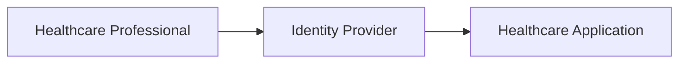
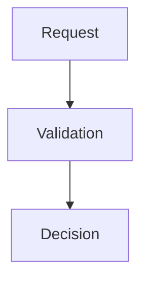
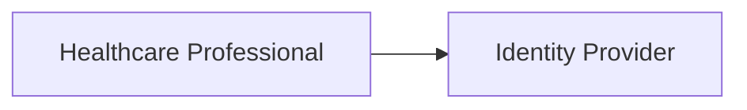
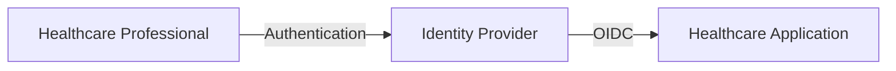
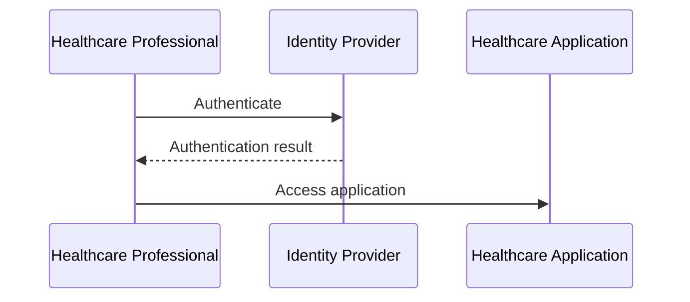
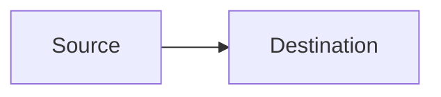

# HIEP Mermaid Standards

## Purpose

This standard defines conventions for Mermaid diagrams in HIEP documentation.

It applies to Mermaid diagrams stored as reusable diagram source and Mermaid
diagrams embedded directly in managed HIEP documents.

General Markdown conventions are defined in
`standards/Markdown-Standards.md`.

## Preferred Use

Mermaid is the preferred diagram-as-code format for diagrams that can be
represented clearly in text.

Typical uses include:

- architecture diagrams;
- identity flows;
- sequence diagrams;
- trust relationships;
- process flows;
- integration flows.

Use Mermaid when a text-based diagram provides sufficient clarity and can be
maintained effectively in Git.

Complex diagrams may use Draw.io when Mermaid does not provide sufficient
clarity.

## Source

Store reusable Mermaid source under:

`diagrams/mermaid/`

Diagrams may also be embedded directly in Markdown when the diagram belongs to
a specific document.

Embedded Mermaid diagrams must use a fenced `mermaid` code block.

Example:



## Direction

Choose diagram direction based on readability and the purpose of the diagram.

For architecture and integration diagrams, left-to-right is generally
preferred where it reflects the flow naturally.

Example:


Top-to-bottom may be used when it communicates the structure or process more
clearly.

Example:



## Node Identifiers

Use short, stable and meaningful Mermaid node identifiers.

Prefer:

```text
User
IdP
EHR
PAM
API
```

Avoid meaningless identifiers such as:

```text
A1
X37
Node999
```

unless the diagram itself requires them.

Node identifiers are implementation details of the Mermaid source and should
remain understandable to someone maintaining the diagram.

## Labels

Labels should describe the actual component, actor, capability or process.

Example:



Avoid excessive text inside diagram nodes.

Move detailed explanation into the surrounding document.

## Flows

Label important flows where the protocol, action or relationship matters.

Example:



Do not label every connection when the meaning is already clear from the
diagram and surrounding text.

## Sequence Diagrams

Use sequence diagrams when message order or interaction between actors is
important.

Example:



Keep message descriptions concise.

Detailed protocol behavior should be explained in the accompanying document
where necessary.

## Trust Boundaries

Represent trust boundaries when they are relevant to the architecture or
security discussion.

The meaning of a trust boundary must be explained in the accompanying text.

Do not rely solely on visual styling to communicate security-relevant meaning.

Security diagrams should make relevant actors, systems and trust relationships
explicit.

## Vendor Neutrality

Use logical capability names in vendor-neutral architecture diagrams.

Examples include:

```text
Identity Provider
Privileged Access Management
Healthcare Application
Directory Service
API Gateway
```

Use product or vendor names when the diagram is intentionally describing a
physical, implementation-specific or vendor-specific architecture.

The purpose of the diagram should make this distinction clear.

## Complexity

A diagram should communicate a specific idea.

Prefer multiple understandable diagrams over one diagram containing every
possible component and relationship.

If a diagram requires extensive explanation merely to understand its visual
structure, consider splitting it into multiple diagrams.

## Styling

Avoid unnecessary custom styling.

Diagrams should remain readable in:

- light themes;
- dark themes;
- common Git-based repository renderers;
- supported Markdown editors.

Do not depend on specific colors as the only way to communicate meaning.

Prefer structural clarity, labels and surrounding explanation.

## Accessibility

Important meaning should not depend solely on visual presentation.

Provide sufficient surrounding text so that the purpose and important
conclusions of the diagram can be understood without relying exclusively on
color, position or styling.

## Markdown Integration

Embedded Mermaid diagrams must follow the fenced-code conventions defined in
`standards/Markdown-Standards.md`.

Example:

````text

